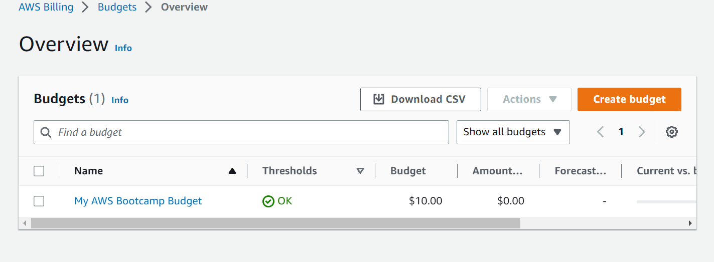
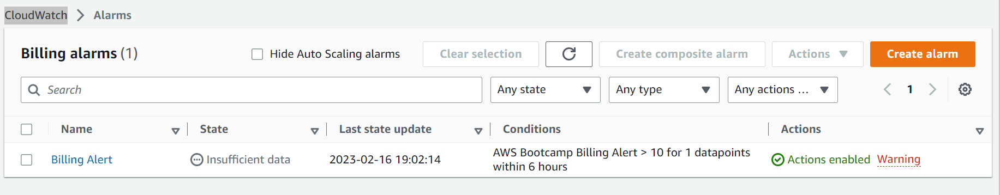
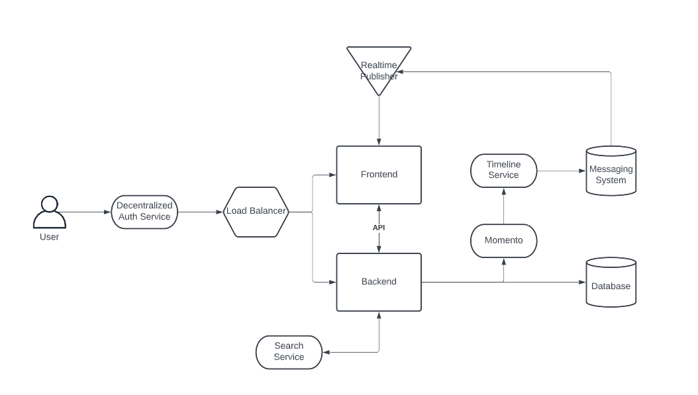
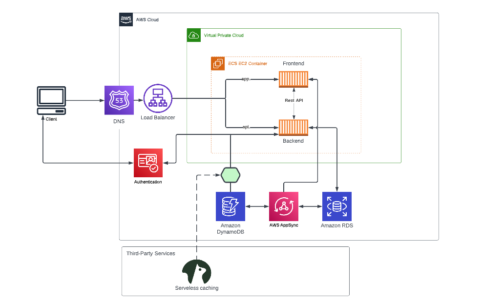

# Week 0 — Billing and Architecture

## Required Homework

### Install AWS CLI
I was able to install AWS CLI using gitpod.

### Create a Budget
I created a budget of $10 for the AWS Project.
I created just one budget so as to not go over the 2 budget free limit.

### Create a Billing Alarm
I created a billing alert to make sure I don't go over the threshold of $10.

### Recreate Crudder Conceptual Diagram

[Lucid Chart Share Link](https://lucid.app/lucidchart/d70b391f-e8b5-417d-9404-ba3ad24cb5c6/edit?viewport_loc=-58%2C172%2C2463%2C1037%2C0_0&invitationId=inv_258eb737-ba32-45b4-b773-a6a2244a052a)

### Recreate Crudder Logical Architecture Diagram

[Lucid Chart Share Link](https://lucid.app/lucidchart/0e551296-91c0-414a-b241-32624f74b0c0/edit?viewport_loc=-581%2C43%2C3100%2C1305%2C0_0&invitationId=inv_6ee3ef4d-ebec-4ffd-8ffb-cb2d09ca7ba2)
