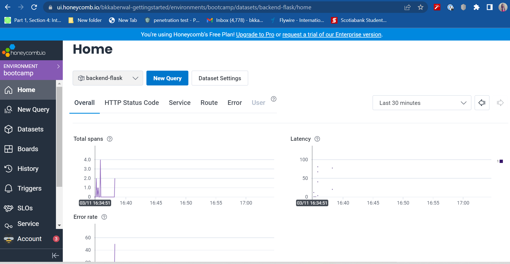
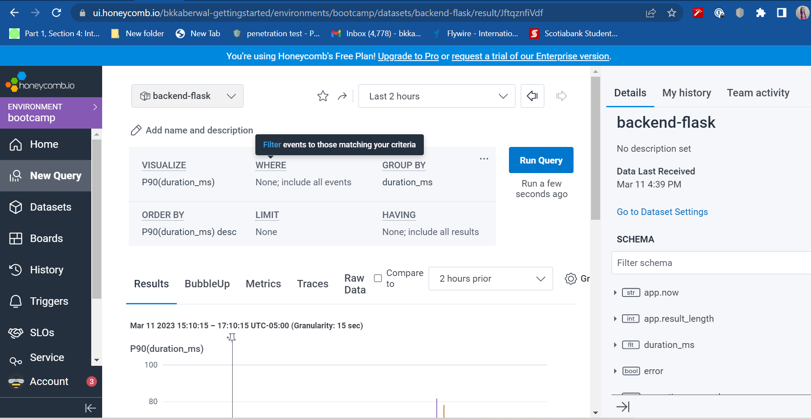
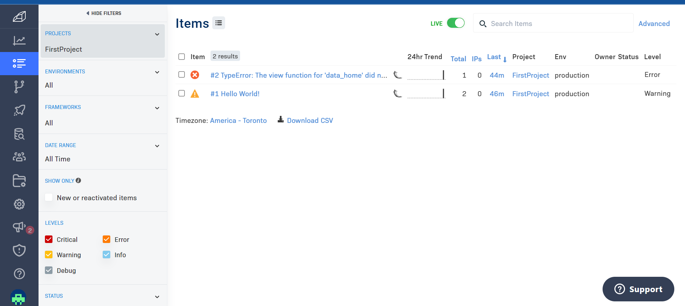

# Week 2 — Distributed Tracing

## Required Homework

### Instrument our backend flask application to use Open Telemetry (OTEL)
I was able to implement OTEL with honeycomb.io after watching the lecture for week 2.

#### Run queries within Honeycomb.io
I learned about running queries to explore traces within Honeycomb.io and was able to successfully run some queries.

### Instrument XRay
I was able to instrument AWS X-Ray into my backend flask application by following along the videos on X-Ray.
Successfully configured X-Ray daemon within docker-compose and was able to send data back to X-Ray API. I then looked at the X-Ray traces within the AWS Console.

After implementing X-Ray I commented out all the related code so that I don't incur any costs for it.

### Implement Rollbar
I integrated Rollbar for Error Logging. I was initially not getting any items in my Rollbar account despite following all the steps in the video. I took a break from this and when I restarted gitpod, it worked! I was also able to trigger an error with Rollbar as well.

