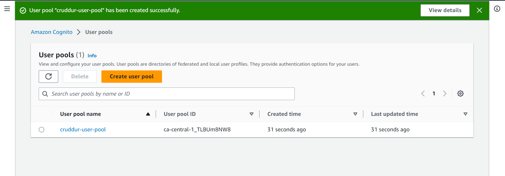
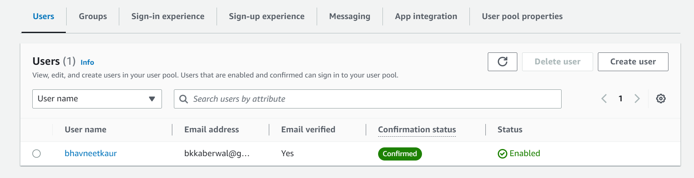
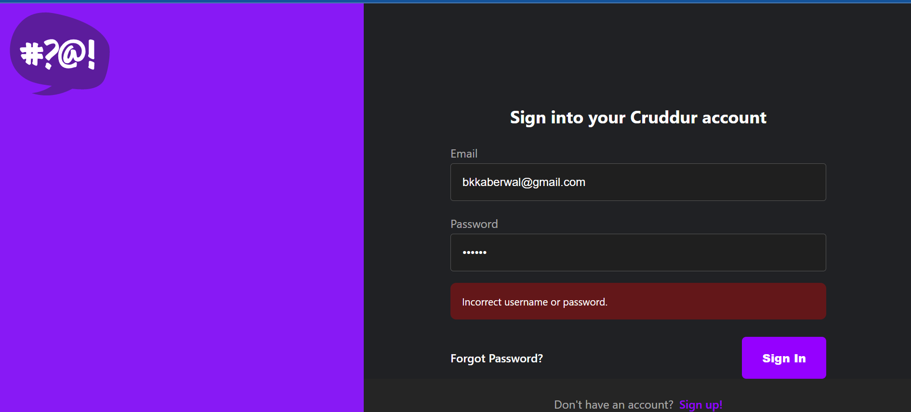
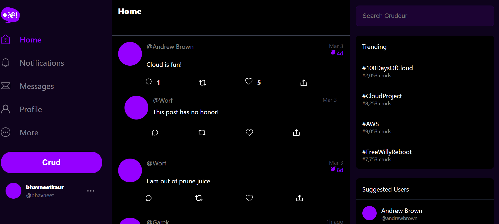
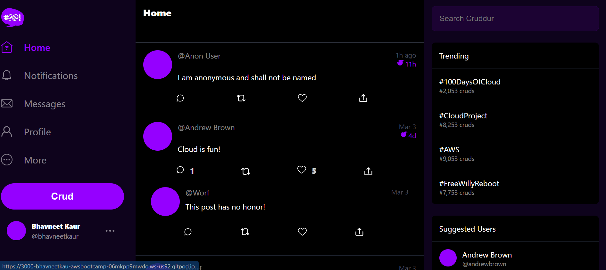
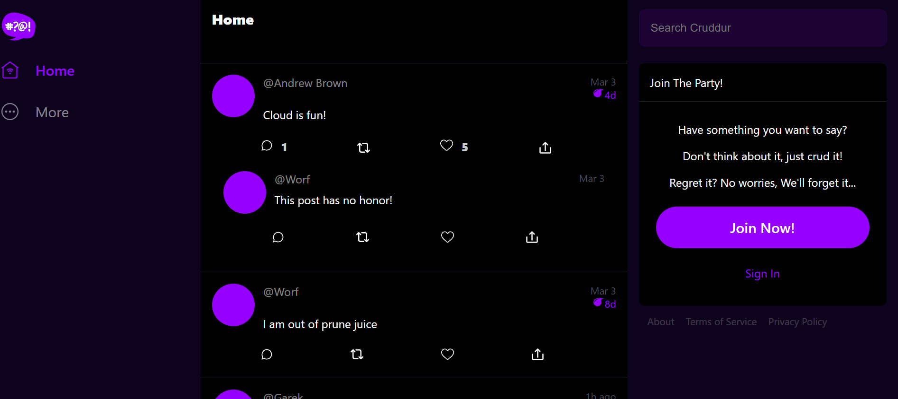

# Week 3 — Decentralized Authentication

## Required Homework

### Create a Amazon Cognito User Pool
I implemented a AWS Cognito user pool for my cruddur app.

### Install and configure Amplify client-side for Amazon Congito
I was able to implement aws-amplify for Amazon Cognito.

### Implement API calls to Amazon Coginto
I implemented API calls to aws cognito for custom login, signup, recovery and forgot password page.

#### Error message on SignIn Page 

#### Home Page after sign-in

### Show conditional elements and data based on logged in or logged out
I successfully implemented the frontend to show/hide elements based on authentication.

#### HomePage for Authenticated User

### HomePage for Unauthenticated User

