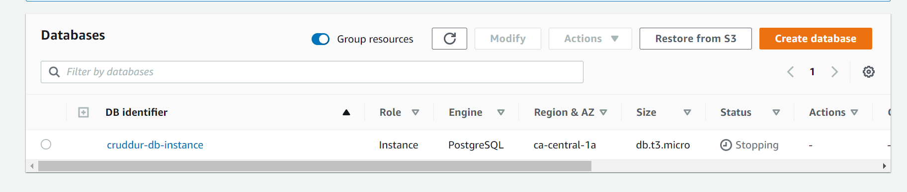
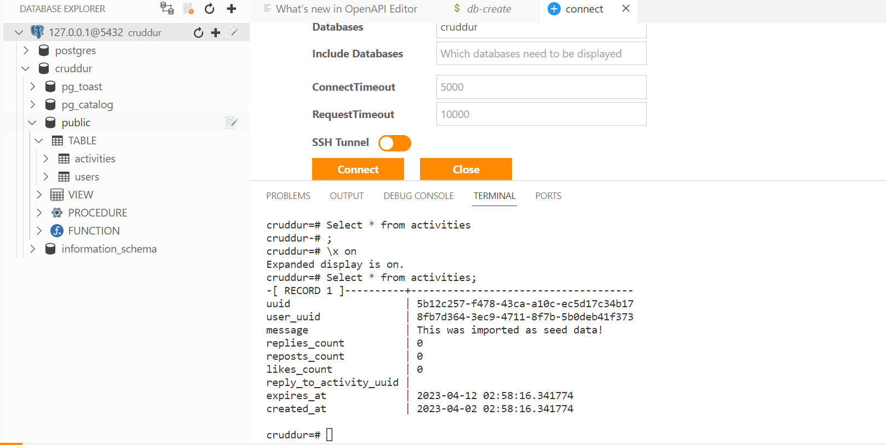
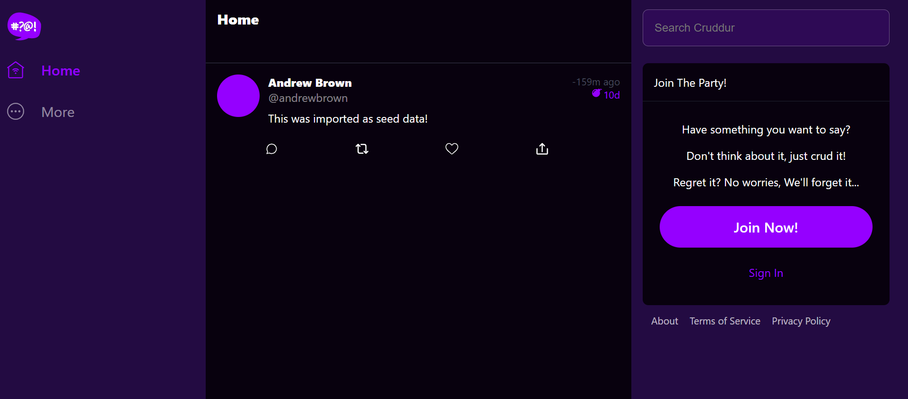
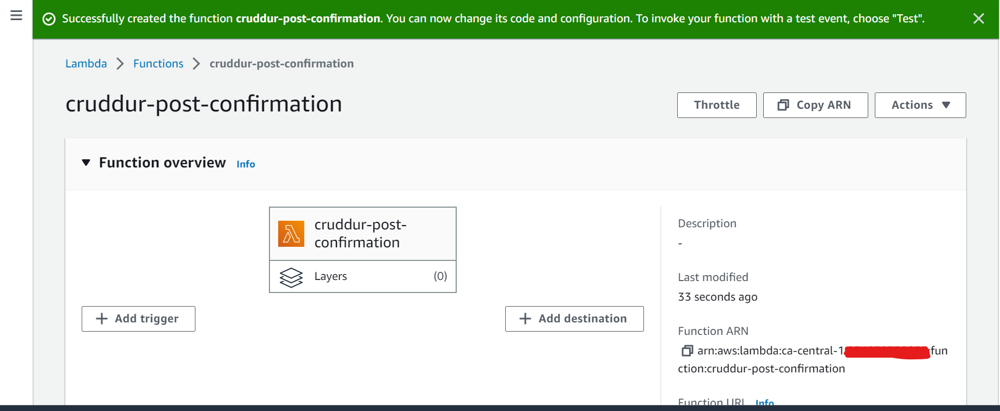
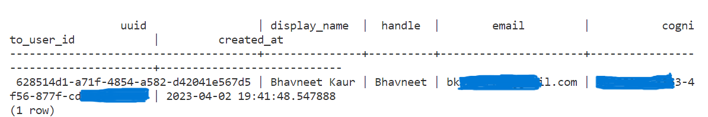
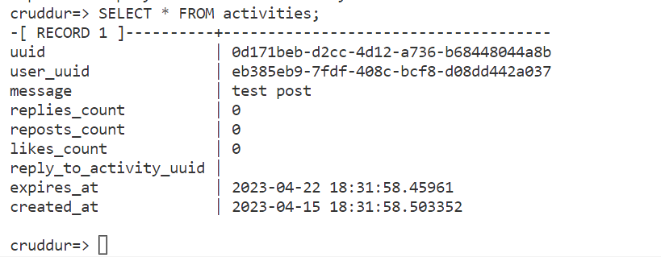

# Week 4 — Postgres and RDS

## Required Homework

### Create RDS Postgres Instance
I watched the lecture video for Week 4. By following along, I was able to create and Instance for the database.

### Create Schema for Postgres
I was able to create a Schema for Postgres. I was able to sucessfully connect to Postgres from gitpod.

### Bash scripting for common database actions
Craeted scripts to perform actions like create db, drop db, create tables in the database, add data to the database, connect to db, setup all the tables with just one script. I followed along the instruction video for these and understood how to write such scripts

#### Install Postgres driver in backend application
I successfully installed the Postgres driver in the backend application

#### Connect Gitpod to RDS instance
I connected Giptpod to my RDS instance. I was able to post some data to the database and then retrieved it on the home page in the front end.

### Create AWS Cognito trigger to insert user into database
Creates a cognito trigger to be able to insert a user who signs up on the frontend into the database.

### Create new activities with a database insert
By following along the video I was able to write queries for registering activities into the database. I was stuck for a while on this as the data wasn't being posted into my prod instance of the database. I troubleshooted some issues and used some discussions in the discord channel to resolve this issue.

