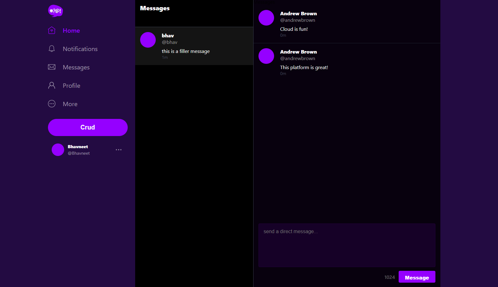
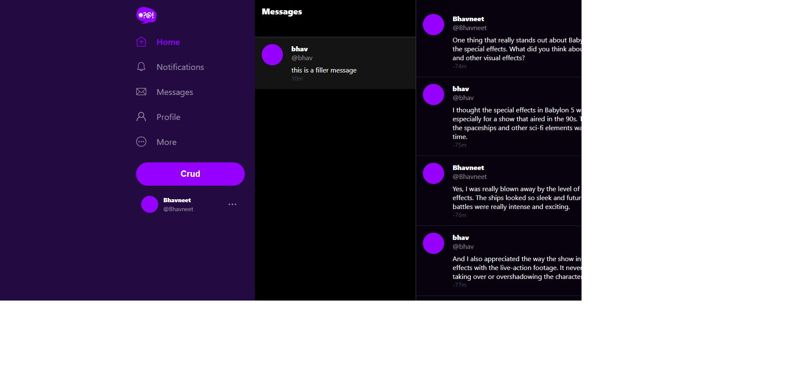
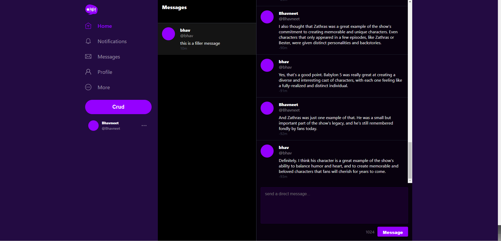
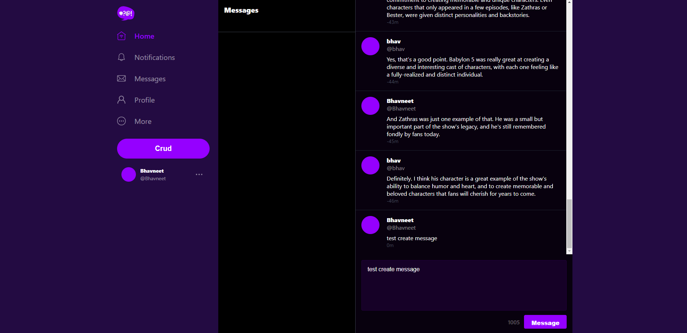
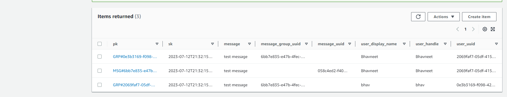

# Week 5 — DynamoDB and Serverless Caching

## Required Homework

### Implement scripts
#### Schema Load script
Added the schema-load script to add the table for cruddur messages.

####  Seed script
Added the seed script to add the data for the cruddur messages table.

#### Scan script
Added the scan script to scan the contents of the cruddur messages table.

#### Pattern scripts
Added scripts to `get-conversation` and `list-conversations`.

#### Update Cognito ID script
Added a script to update the cognito ID of the users in the database.

### Implement Pattern A
Implemented Listing Messages in Message Group into Application.

### Implement Pattern B
Implemented Listing Messages Group into Application.

#### Messages in message group

#### Messages in message group(cont.)

#### Message group uuid in the url

### Implement Pattern C
Implemented Creating Message for an existing Message Group into Application.

### Implement Pattern D
Implemented Creating a Message for a new Message Group into Application.

### Implement Pattern E
Implemented Updating a Message Group using DynamoDB streams.

